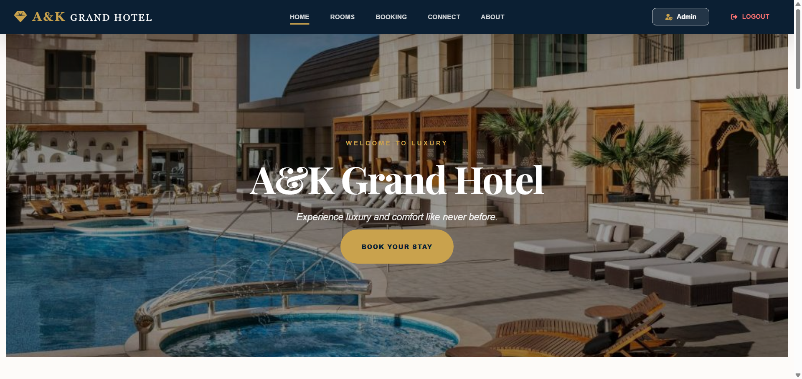
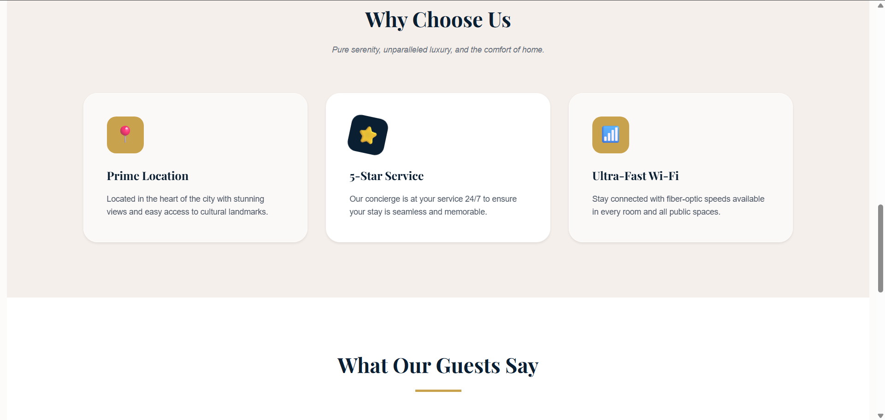
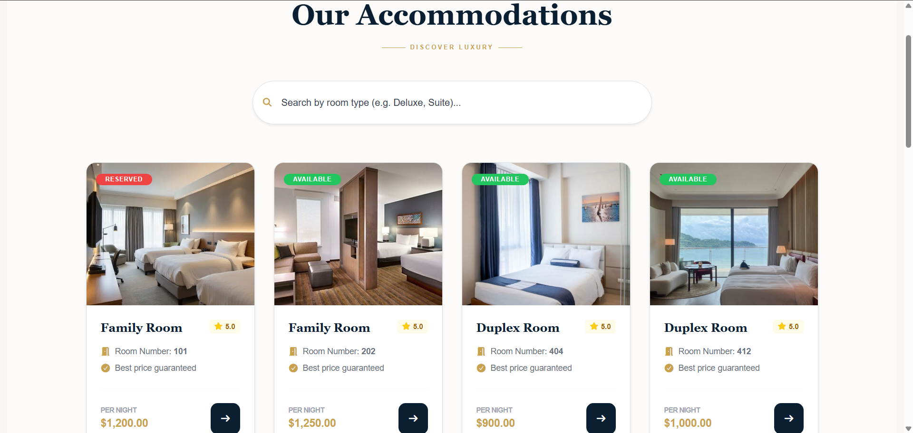
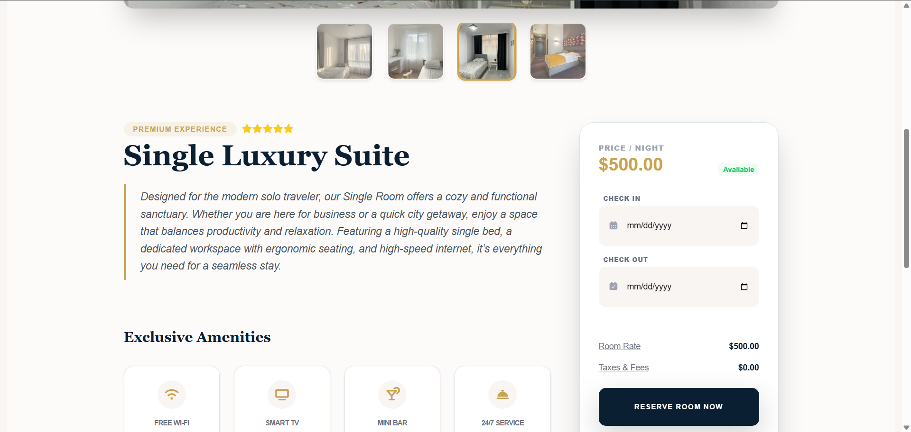
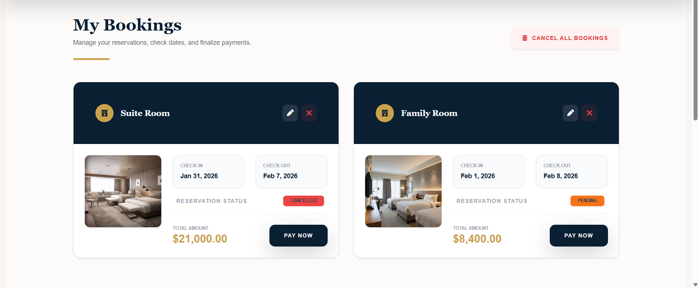
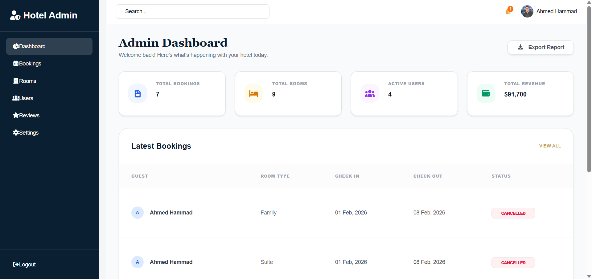
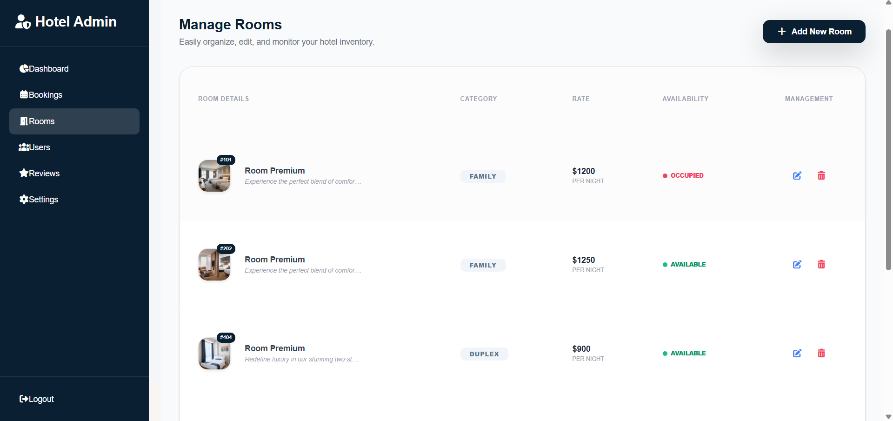
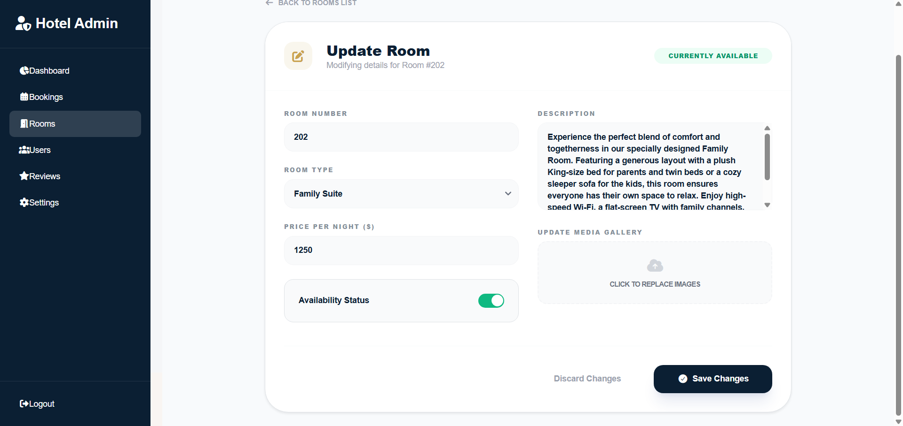

# 🏨 A&K Grand Hotel - Luxury Reservation Platform
=====================================

## 🌟 Overview
A&K Grand Hotel is a premium full-stack reservation system designed to provide a seamless booking experience. The platform features a high-end user interface for guests and a powerful administrative backend for hotel management, bridging the gap between luxury hospitality and modern technology.

## 🚀 Features

### For All Guests
- Luxury Room Showcase: Browse rooms with high-quality imagery and detailed descriptions.
- Dynamic Hero Interface: Smooth, auto-playing visuals highlighting the hotel’s premium spots.
- Advanced Filtering: Find the perfect room based on category and availability.
- Responsive Design: Fully optimized for mobile, tablet, and desktop views.

### For Registered Users
- Secure Authentication: User-specific login and registration flow.
- Booking Management: Seamlessly book rooms and manage your reservations.
- Guest Feedback: Leave reviews and star ratings to share your experience.
- Profile Management: Manage your personal details and booking history.

### For Admins
- Complete Administrative Dashboard: Manage hotel data, room availability, and guest lists.
- Review Oversight: Monitor and manage guest testimonials.
- Site Statistics: Get insights into bookings and hotel performance.
- Content Management: Update room details, pricing, and hotel information dynamically.

## 📸 Screenshots

### Home Page



### Room Selection



### Booking Page


### Admin Dashboard



## 🛠 Technologies Used

- Frontend: 
  - Angular 19+ (Standalone Components)
  - Tailwind CSS (Luxury Custom Theme)
  - Lucide & Font Awesome Icons
- Backend: 
  - .NET Core / Web API
  - JWT (JSON Web Tokens) for Security
- Database: 
  - SQL Server / Entity Framework Core
  

## 💻 Installation and Setup

1. Clone the repository:
      git clone [https://github.com/your-username/ak-grand-hotel.git](https://github.com/your-username/ak-grand-hotel.git)
   cd ak-grand-hotel
2. **Frontend Setup (Angular):**
  ```bash
   cd frontend
   npm install
   ng serve
  
3. Backend Setup (.NET):
  
  cd backend
  dotnet restore
  dotnet run
  
## 👥 Project Contributors
This project is a collaborative effort between:

Kareem Mohamed - Frontend Architect

Responsible for UI/UX Design, Angular Component Architecture, and Client-side Logic.

Ahmed Hammad - Backend Strategist

Responsible for API Design, Database Schema, and Security Implementation.
